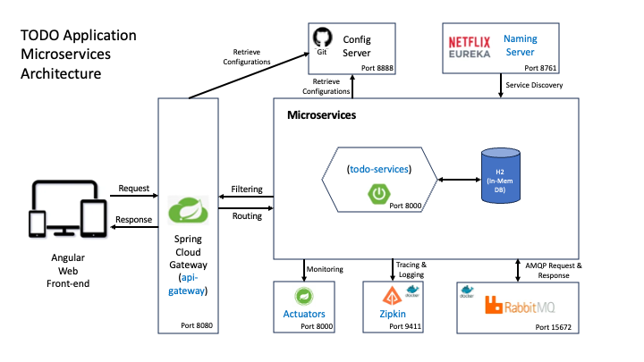

# TO-DO List Management Application - Spring Boot Microservices

## Table of Contents
* [Objectives](#objectives)
* [App Description](#app-description)
* [Technologies Used](#technologies-used)
* [Microservices Eco-Systems Deployed](#microservices-eco-systems-deployed)
* [Acknowledgements](#acknowledgements)

## Objectives

**Microservices** is the modern architectural design pattern that enables improved separation of responsibilities among various application components, faster deployment, plug & play release management, stronger security, improved monitoring, rapid debugging and many other features. While implementation of restful services is an important aspect of Microservices development, the real benefit comes from how independently the components are designed and how diligently those are deployed in production environment.

There are several development and deployment principles that need to be followed while deploying microservices in live environment. We miss out some or many of them often in real projects that inhibits us from reaping the full benefits of the architecture. This simple application has been developed and deployed using many of the key microservices practices so as to **act as a ready reference and reminders to architects** who would use this architecture in their organisations to resolve business problems.

## App Description

This is a simple web-based **Todo List management** app which allows already registered users to login to the app and then add/ update/ delete Todos with each having target date of completion and status fields.

## Technologies Used

This is application has been developed using Angular for the web front-end and Java Spring Boot and JPA framework at the backend along with H2 in-memory database.

## Microservices Eco-Systems Deployed

The following microservices deployment components have been used in this application. Any architect, aiming to deploy a working microservices architecture in their organisation, should consider these components as part of their deployment architecture.

The application has been deployed on AWS Cloud (2 nos. of EC2 instances) as well as on local machine. The application functionalities including the various deployment components can be demonstrated on request.

### Todo Service

This is the only and main restful microservice that manages the CRUD operations related to Todo List management. It uses JPA to connect to H2 in-memory DB to store and retrieve Todo data.

#### Usage

    Deploy: java -jar todo-microservices-0.0.1-SNAPSHOT.jar --spring.profiles.active=default --spring.h2.console.settings.web-allow-others=true

    API Prefix: http://<IP Address/Domain Name>:8000

    Get Todos (GET Method): "/todo-services/get-all-todos/user/{username}/todos"

    Get One Todo (GET Method): "/todo-services/get-todo/user/{username}/todo/{todo_id}

    Create Todo (POST Method): "/todo-services/add-todo/user/{username}/todo"

    Update a Todo (PUT Method): "/todo-services/update-todo/user/{username}/todo/{todo_id}"

    Delete a Todo (DELETE Method): "/todo-services/delete-todo/user/{username}/todo/{todo_id}"

### Discovery Services

Netflix Eureka Naming Server is used as discovery service for the Microservices. The Todo Service and API Gateway register with Naming Server during initialisation.

#### Usage

    Deploy: java -jar naming-server-0.0.1-SNAPSHOT.jar --spring.profiles.active=default

    View: http://<IP Address/Domain Name>:8761

### API Gateway

Calls to REST APIs provided by Todo Service is routed through Spring Cloud Gateway. It registers with Eureka naming service and picks the port details of the APIs from the same naming server.

#### Usage

    Deploy: java -jar api-gateway-0.0.1-SNAPSHOT.jar --eureka.client.serviceUrl.defaultZone=http://<Naming Server IP Address>:8761/eureka

### Config Server

Config Server provides the external configuration parameters used by the Todo microservice. The config properties are listed in a file placed under git. Through this arrangement, Config Server can centrally manage the properties of all microservices and enables changes in properties without actually having to restart the microservices.

#### Usage

    Deploy: java -jar todo-config-server-0.0.1-SNAPSHOT.jar --spring.profiles.active=aws

    Config File: git-config-repo/todo-config-service.properties

    Refresh the Todo Service (POST message) Actuator after changing the property value to effect the change using below link along with JWT token

    http://<Todo Service IP>:8000/actuator/refresh

### Monitoring Service

Monitoring of the health of Todo service can be done by observing the metrics available at below link:

#### Usage

    View Health Parameters: http://<Todo Service IP>:8000/actuator
    (Use JWT token along with GET request)

### Tracing & Logging Service

Tracing & Logging facilities are built on the concept of Observability that deals with collection of application metrics, logs and traces and deliver intelligence on any anomalies in operation. *OpenTelemetry* is the industry standard for observability that is implemented through Zipkin Distributed Tracing Server.

In this project, Docker image of Zipkin has been used thus preventing the need to install various components associated with Zipkin server (e.g. RabbitMQ).

#### Usage

    Deploy: docker run -p 9411:9411 openzipkin/zipkin:2.23
    

## Acknowledgements

This project is based on two online training developed by Ranga Karanam, as part of his company in28Minutes Official, which are as follows:

1) Go Java Full Stack with Spring Boot and Angular (https://www.udemy.com/course/full-stack-application-development-with-spring-boot-and-angular/)

2) Master Microservices with Spring Boot and Spring Cloud (https://www.udemy.com/course/microservices-with-spring-boot-and-spring-cloud/)
